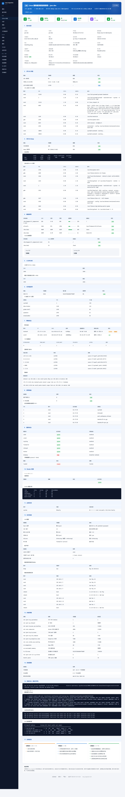

# Linux Auto Inspection

**Linux 服务器一键巡检脚本** — 纯 Bash 编写，零依赖，自动生成结构化 HTML 巡检报告。

[](https://www.gnu.org/software/bash/)
[](LICENSE)
[]()
[]()

---

## 功能概览

一条命令完成服务器巡检，覆盖 **17 大类 25+ 项检查维度**，输出可读性强的 HTML 报告。

```
==============================================
  Linux Inspection v2.4
  Host: jum-dev
  Time: 2026-05-10 20:34:46
  Format: html  |  Verbose: off
  Steps: 19
==============================================
[ 1/19] (  5%) 采集基本信息（主机/CPU/内存/网络/虚拟化）...
[ 2/19] ( 10%) 检查 CPU 使用率与负载...
[ 3/19] ( 15%) 检查内存与 Swap...
...
[19/19] (100%) 生成报告（html）...

==============================================
  Linux Inspection v2.4 - 巡检完成
  Host: jum-dev
  Steps: 19/19
  Warnings: 2    Critical: 0
  Elapsed: 0m12s
  Format: html
  Report: /tmp/inspect_report/inspect_jum-dev_20260510_203446.html
==============================================
```

### 报告样式（v2.4）

参考 Token Insight 风格的现代 dashboard 排版：



设计要点：

- **顶部蓝色 banner** — 主机/IP/操作系统/内核/生成时间/工具版本 一行展示
- **6 张概览卡片** — 左侧方形 SVG 图标 + 大数字 + 状态标签（CPU / 内存 / 磁盘告警 / 负载 / TCP 连接 / 警告）
- **17 个编号章节** — 浅蓝色标题底栏 + 蓝色编号前缀，左侧深色侧栏导航 + 锚点跳转
- **总体建议** — 短期/中期/长期 3 列卡片，根据告警动态生成
- **打印友好** — `@media print` 完整样式

---

## 快速开始

### 环境要求

- Linux 系统（Rocky / RHEL / CentOS / Ubuntu / Debian / Kylin / SUSE）
- **Bash 4.0+**（用到 here-string `<<<`、关联数组等特性）
- root 权限（建议，部分检查项需要）

### 安装

```bash
git clone https://github.com/Aidan-996/Linux_Auto_Inspection.git
cd Linux_Auto_Inspection
chmod +x linux_inspect.sh
```

### 单行命令（无需克隆）

```bash
curl -sO https://raw.githubusercontent.com/Aidan-996/Linux_Auto_Inspection/main/linux_inspect.sh \
  && chmod +x linux_inspect.sh \
  && ./linux_inspect.sh --fast
```

### 用法

```bash
# 完整巡检（含联网更新检查 + SSL + 大文件扫描，约 30-60 秒）
./linux_inspect.sh

# 快速模式（推荐日常巡检，约 8-15 秒）
./linux_inspect.sh --fast

# JSON 输出（对接 Prometheus / 监控平台）
./linux_inspect.sh -f json -o /tmp/inspect.json

# 自定义输出路径 + 详细日志
./linux_inspect.sh -v -o /var/log/inspect.html

# 查看帮助
./linux_inspect.sh -h
```

### 命令行参数

| 参数 | 说明 |
|---|---|
| `-o FILE` | 指定报告输出路径 |
| `-f FORMAT` | 输出格式：`html`（默认）/ `json` |
| `-v, --verbose` | 详细日志（含 debug 信息） |
| `-q, --quiet` | 静默模式（仅错误输出） |
| `--no-large-file-scan` | 跳过大文件扫描 |
| `--skip-update-check` | 跳过包管理器联网检查（最慢的单步） |
| `--skip-ssl-check` | 跳过 SSL 证书扫描 |
| `--fast` | 快速模式 = 上面三个 skip 全开 |
| `-h, --help` | 显示帮助 |

### 退出码语义化

| 退出码 | 含义 | 用途 |
|---|---|---|
| `0` | 正常 — 无警告无严重 | CI 通过 |
| `1` | 有警告 | CI 警告（黄） |
| `2` | 有严重告警 / 脚本错误 | CI 失败（红）|

---

## 检查维度（17 大类）

### 1. 基本信息
主机名、FQDN、IP、操作系统、内核、架构、运行时间、CPU 型号/核数、总内存、SELinux、防火墙、虚拟化（vmware/kvm/hyperv/xen）、厂商型号/序列号/BIOS。

### 2. CPU & 负载
CPU 使用率、1/5/15 分钟负载（对比核数告警）、CPU 占用 TOP 10 进程。

### 3. 内存 & Swap
字节级精确使用率、`free -h` 详情、内存占用 TOP 10 进程。

### 4. 磁盘使用
所有挂载点空间使用率（带进度条）、Inode 使用率、磁盘 I/O（iostat）、状态徽章。

### 5. 大文件分析
扫描 `>100M` 大文件 TOP 10、近 7 天修改的 `>50M` 文件 TOP 10（限定 `/var /home /opt /usr/local`）。

### 6. 文件描述符
系统 FD 使用率、TOP 5 占用进程。

### 7. 网络状态
网卡信息（IP/MAC/速率/RX/TX 流量/错误丢包）、TCP 连接（ESTABLISHED/TIME_WAIT/CLOSE_WAIT 等）、监听端口前 30、路由表、DNS/网关。

### 8. 进程检查
僵尸进程（Z）、D 状态进程、运行最长进程 TOP 5。

### 9. 服务状态（38 个常见服务）
sshd / crond / firewalld / ufw / chronyd / docker / containerd / kubelet / nginx / httpd / mysqld / mariadb / postgresql / redis / mongod / elasticsearch / php-fpm / tomcat / supervisord / zabbix-agent / node_exporter / prometheus / grafana-server / haproxy / keepalived / postfix / smbd ... 等。

### 10. Docker 容器
容器列表、镜像列表（前 15）、`docker system df` 磁盘占用。

### 11. 定时任务
系统 crontab（`/etc/crontab` + `/etc/cron.d/`）、所有用户 crontab。

### 12. 安全检查
SSH 配置（PermitRootLogin / Port / MaxAuthTries / PubkeyAuthentication）、UID=0 账户、空密码账户、密码即将/已过期账户、最近失败/成功登录记录、SUID/SGID/全局可写文件扫描。

### 13. 内核参数（13 项 sysctl）
`tcp_syncookies` / `ip_forward` / `tcp_max_syn_backlog` / `somaxconn` / `tcp_tw_reuse` / `tcp_fin_timeout` / `tcp_keepalive_time` / `netdev_max_backlog` / `swappiness` / `overcommit_memory` / `file-max` / `rp_filter` / `kernel.panic`。

### 14. 系统更新
yum / dnf / apt / zypper 多包管理器自动适配（Kylin/RHEL/Debian/SUSE），可用更新数 + 安全更新数 + 上次更新时间。

### 15. SSL 证书 ⭐ v2.3+
扫描 `/etc/letsencrypt/live`、`/etc/ssl/certs`、`/etc/pki/tls/certs`、`/etc/nginx/ssl` 等路径，提取 CN / 到期时间 / 剩余天数，剩余 < 30 天告警。

### 16. 系统日志
最近异常（error/fail/critical/panic/oom）、OOM 事件次数、硬件错误（dmesg ECC/IO error）、认证日志异常、NTP 时间源详情。

### 17. 总体建议 ⭐ v2.4
基于警告数据动态生成短期（1-3 天）/ 中期（1-4 周）/ 长期（1-6 个月）维护建议。

---

## 配置说明

脚本顶部集中配置区，按实际环境调整：

```bash
# 阈值
CPU_WARN=80
MEM_WARN=85
DISK_WARN=85
INODE_WARN=85
SWAP_WARN=50
FD_WARN=80
LOAD_WARN_FACTOR=2
CRIT_OFFSET=10                  # 严重 = 警告 + 10
CONN_CLOSE_WAIT_THRESHOLD=50    # CLOSE_WAIT 偏高阈值

# 列表数量
TOP_N=10
FD_TOP_N=5
LOG_LINES=20

# 大文件
LARGE_FILE_SIZE="+100M"
RECENT_FILE_DAYS=7
RECENT_FILE_SIZE="+50M"
LARGE_FILE_SEARCH_PATHS="/var /home /opt /usr/local"

# SSL 证书
SSL_CERT_DAYS_WARN=30

# 输出（也可用 -o / 环境变量 INSPECT_REPORT_DIR 覆盖）
REPORT_DIR="/tmp/inspect_report"
```

### 三级告警

| 级别 | 条件 | 颜色 |
|---|---|---|
| 正常 | < 警告阈值 | 绿色 |
| 警告 | >= 警告阈值 | 橙色 |
| 严重 | >= 警告阈值 + `CRIT_OFFSET`（默认 10） | 红色 |

---

## 进阶用法

### 定时巡检 + 邮件通知

```bash
# crontab -e
0 8 * * * /opt/scripts/linux_inspect.sh --fast && \
  REPORT=$(ls -t /tmp/inspect_report/*.html | head -1) && \
  echo "巡检报告见附件" | mail -s "$(hostname) 每日巡检报告" \
  -a "$REPORT" admin@example.com
```

### CI/CD 集成（基于 exit code）

```bash
# Jenkins / GitLab CI
./linux_inspect.sh --fast
case $? in
  0) echo "✅ 巡检通过" ;;
  1) echo "⚠️ 有警告，请查看报告" ;;
  2) echo "❌ 严重告警，立即处理" && exit 1 ;;
esac
```

### JSON 对接监控平台

```bash
./linux_inspect.sh -f json -o /tmp/r.json
# 输出示例
{
  "version": "v2.4",
  "host": { "hostname": "...", "ip": "...", "os": "...", ... },
  "metrics": { "cpu_usage_pct": 12, "mem_usage_pct": 34, ... },
  "ssl": { "total": 4, "expiring_in_30_days": 2, "expired": 0 },
  "result": { "warnings": 2, "critical": 0, "exit_code": 1 }
}

# Push 到 Prometheus pushgateway / Telegram bot / 自建 API
curl -X POST https://your-monitor.example.com/api/inspect \
  -H "Content-Type: application/json" -d @/tmp/r.json
```

### 批量巡检

```bash
#!/bin/bash
SERVERS="192.168.1.10 192.168.1.11 192.168.1.12"
mkdir -p ./reports
for ip in $SERVERS; do
    echo "=== 巡检: $ip ==="
    ssh root@$ip 'bash -s -- --fast' < linux_inspect.sh
    scp root@$ip:/tmp/inspect_report/*.html ./reports/${ip}.html
done
```

### 企业微信告警

```bash
if (( CRITICAL_COUNT > 0 )); then
    curl -s "https://qyapi.weixin.qq.com/cgi-bin/webhook/send?key=YOUR_KEY" \
      -H "Content-Type: application/json" -d "{
        \"msgtype\": \"markdown\",
        \"markdown\": {
          \"content\": \"## 服务器巡检告警\n> 主机: $(hostname)\n> 严重: ${CRITICAL_COUNT} | 警告: ${WARN_COUNT}\"
        }
      }"
fi
```

---

## 性能（v2.4 提速）

| 模式 | 耗时（典型机器） |
|---|---|
| `--fast` | **8-15 秒** |
| 默认（含 SSL + 大文件） | 30-60 秒 |
| 完整（含包管理器更新检查） | 1-3 分钟 |

主要慢点：包管理器联网检查（5-30s）、大文件 find（3-10s），用 `--skip-update-check` 或 `--fast` 可跳过。

---

## 兼容性

| 发行版 | 版本 | 状态 |
|---|---|---|
| Rocky Linux | 8 / 9 / 10 | 已测试 |
| RHEL | 7 / 8 / 9 | 已测试 |
| CentOS | 7 / 8 / Stream | 兼容 |
| Ubuntu | 18.04 / 20.04 / 22.04 / 24.04 | 已测试 |
| Debian | 10 / 11 / 12 | 已测试 |
| Kylin | V10 | 已支持 |
| AlmaLinux | 8 / 9 | 兼容 |
| SUSE / openSUSE | 12+ | 已支持 |

---

## 目录结构

```
Linux_Auto_Inspection/
├── linux_inspect.sh                    # 巡检脚本（主文件，2000+ 行）
├── CHANGELOG.md                        # 版本更新日志
├── linux_inspect_script_analysis.md    # 代码缺陷分析报告
├── README.md                           # 项目说明（本文件）
└── LICENSE                             # MIT 协议
```

---

## 更新日志

完整版本历史见 [CHANGELOG.md](CHANGELOG.md)。简版概览：

### v2.4 (2026-05-10) — 提速 + Token Insight 风排版
- 🚀 **性能优化** — 服务检查缓存、CPU IDLE 简化、dmesg 缓存、shadow 直读替代 chage、SUID/SGID 合并 find，预估 60s → 8-15s
- 🆕 `--fast` / `--skip-update-check` / `--skip-ssl-check` 参数
- 🎨 HTML 模板重构：蓝色 banner + 横向 metadata 字段、17 个章节加蓝色编号、Summary 卡片左图标右数字、4 列基本信息网格
- 🆕 第 17 章节"总体建议"（短期/中期/长期 3 列卡片，动态生成）
- 🆕 免责声明区
- 🛠 巡检 banner + `[N/19] (xx%)` 步骤进度

### v2.3 (2026-05-10) — 缺陷收尾 + 关键新功能
- 🆕 **SSL 证书过期检查**（letsencrypt / ssl / pki / nginx 路径，<30 天告警）
- 🆕 **JSON 输出**（`-f json`，含 host / metrics / ssl / updates / thresholds / result 六大字段）
- 🆕 **HTML 目录导航**（左侧固定 nav，IntersectionObserver scroll-spy）
- 🆕 **Exit code 语义化**（0/1/2 = 正常/警告/严重）
- ✅ 修复剩余 6 个轻微缺陷（错误处理 / 代码重复 / 魔法数字 / Bash 版本检查 / 日志详细 / HTML 转义完善）
- 📊 累计修复 20 项已识别缺陷，全部 close

### v2.2 (2026-05-09) — 完全优化版本
- ⚙️ CPU 检测函数化（`get_cpu_idle()`）
- ⚙️ 内存字节级精算
- ⚙️ SELinux 配置增强（同时显示当前状态 + 配置文件）
- ⚙️ Docker 权限优雅处理
- ⚙️ 执行时间统计 + 版本号显示
- 🐛 here-string 兼容性修复
- 🐛 OOM_COUNT 算术错误修复
- 🎨 HTML 表格列宽 CSS 优化

### v2.1 (2026-05-09) — 主要缺陷修复版
- 🐛 添加依赖检查（缺工具立即退出）
- 🐛 多包管理器支持（Kylin / RHEL / Debian / SUSE 自动适配）
- 🐛 `apt update` / `lastb` 权限保护
- 🐛 空密码账户判断逻辑修正（`!`/`*` 不算空密码）
- ⚙️ 大文件搜索性能优化（限定路径）

### v2.0 (2026-04-08)
- 初始版本，1100+ 行，20+ 检查维度
- 硬件信息、虚拟化检测、磁盘 I/O、大文件、文件描述符、Docker、内核参数等

---

## Contributing | 参与贡献

欢迎提交 Issue 和 Pull Request！详见 [CONTRIBUTING.md](CONTRIBUTING.md)

```
Fork → Clone → Branch → Commit → Push → Pull Request
```

---

## License

[MIT License](LICENSE)
